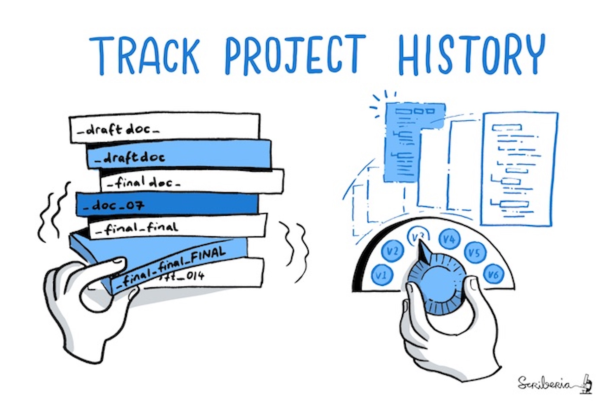

# Welcome! The Journey Awaits

<figure>
    
    <figcaption>Unlike vaguely named files, version control makes it easy go to a specific version of a file. Source: The Turing Way project illustration by Scriberia. DOI: <a href="https://doi.org/10.5281/zenodo.3332807">The Turing Way Community & Scriberia (2024)</a></figcaption>
</figure>

## How to use this resource?

This does *not* contain any guides on how to use `git`. There are tonnes of fantastic resources made by people who know `git` like the back of their hand. So, this is to *signpost* you to these resources.

Instead of giving you a laundry list of all of the resources under the sun, I have selected one or two resources which I think is the best for learning or achieving something. However, best is very subjective. Therefore, I will also include the other resources I have found in a list below the featured ones.

I've also included some demos and content from the talk in their respective pages. I personally don't like looking for information within a video, so the content in those pages are the demos and bits which I think are useful as text.

## Terminal?? That sounds scary — here’s why the demos use it

Demonstrating the various `git` commands works in an IDE, but IDEs can change over time and sometimes obscure what’s happening under the hood. Using the terminal lets you see exactly what’s going on and apply those concepts in any IDE later.

## Are there any recordings of the talks in the series?

Missed out on the talks? Or perhaps you're been 100% sold on using Git and need to try bringing someone else onboard?

[Check out the youtube playlist for the series](https://www.youtube.com/playlist?list=PLHEe13WZmMFarzLXMALCg7mdQLR7ZRAxZ). Or watch the first video here!

  <iframe width="560" height="315" src="https://www.youtube-nocookie.com/embed/videoseries?si=TF4fj_vO6aAC0omU&amp;list=PLHEe13WZmMFarzLXMALCg7mdQLR7ZRAxZ" title="YouTube video player" frameborder="0" allow="accelerometer; autoplay; clipboard-write; encrypted-media; gyroscope; picture-in-picture; web-share" referrerpolicy="strict-origin-when-cross-origin" allowfullscreen></iframe>

## Help!! I've been bitten by the coding bug! What do I do??

Firstly, stay calm. Don't panic. It happens to even the best of us. Each path to and from this point unfurls in countless, unknowable directions, with the grace of a cat knocking a potted plant off a tall shelf - chaotic yet inexplicably elegant.

| I want to ...                                                                  | Link                                                                                                             | Description                                                                                                                                                                                                              |
| ------------------------------------------------------------------------------ | ---------------------------------------------------------------------------------------------------------------- | ------------------------------------------------------------------------------------------------------------------------------------------------------------------------------------------------------------------------ |
| Learn more skills to help with my research                                     | [CodeRefinery workshops](https://coderefinery.org/lessons/)                                                      | Code refinery "teaches all the essential tools which are usually skipped in academic education so everyone can make full use of software, computing, and data with focus on reusability, reproducibility, and openness." |
| Basics about unix and programming in Python or R                               | [Software Carpentry lessons](https://software-carpentry.org/lessons/)                                            | "Software Carpentry is a lesson program within The Carpentries teaching basic lab skills for research computing"                                                                                                         |
| Read a book that's both philosophical and introduces computer science concepts | [Gödel, Escher, Bach](https://en.wikipedia.org/wiki/G%C3%B6del,_Escher,_Bach)                                    | This is the first computer science book I ever read. It explains computer science concepts in a very approachable manner and has an underlying philosophical question about how cognition emerges                        |
| Read a book about creating good software                                       | [The Pragmatic Programmer](https://pragprog.com/titles/tpp20/the-pragmatic-programmer-20th-anniversary-edition/) | This book "examines the core of modern software development—understanding what is wanted and producing working, maintainable code that delights its users"                                                               |

## I don't believe your "good coding practice" conspiracy theory. Are you just making this up?

Yes, I am. 😉 Check out these resources,

- Blog post: [The Hitchhiker’s Guide to Research Software Engineering: From PhD to RSE](https://invenia.github.io/blog/2020/07/07/software-engineering/)
  - The section "What I wish I knew in my PhD" is a great read for people just starting their PhD or in the throes of it.
- Chapter on [Version Control](https://book.the-turing-way.org/reproducible-research/vcs) in The Turing Way
  - [The Turing Way](https://book.the-turing-way.org/) is a fantastic handbook for learning more about [how to make your research can be reproducible](https://book.the-turing-way.org/reproducible-research/reproducible-research), [how to plan and manage your project](https://book.the-turing-way.org/project-design/project-design) and [how to communicate your research](https://book.the-turing-way.org/communication/communication)
  - The Turing Way is massive and can feel daunting to read. However, they have pathways, e.g. [Early Career Researchers](https://book.the-turing-way.org/communication/communication), which are a curated list of chapter targeted for the pathway's audience.

## I've started using `git`, does this mean my research is now 100% reproducible?

Unfortunately, it isn't. There are different levels of reproducibility. Plus, if you're the only one that can make heads or tails out of it, then others won't be able to reproduce it either.

Using `git` certainly is a step in the right direction. However, it isn't a panacea.

- If you'd like to learn more about how to make your research reproducible, I highly recommend [this code refinery lesson on how to build reproducible programs and computations](https://coderefinery.github.io/reproducible-research/intro/).
- If you're looking for a more in-depth guide, I highly recommend [the Turing Way guide for reproducible research](https://book.the-turing-way.org/reproducible-research/reproducible-research/).

<!-- ## Where are your demos?

The demos are below the list of resource available. -->

## GRRR a link is broken...

I apologise in advance. But, things move around on the internet. Please open an [issue](https://github.com/wong-hl/git-for-researchers/issues) and I'll do my best to fix it!

## Come across a life-changing resource you would like to share?

Please open a [pull request](https://github.com/wong-hl/git-for-researchers/pulls)!
