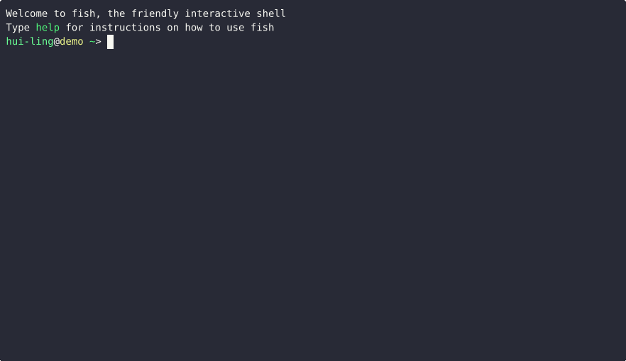

# Starting with Git

| I'm looking for a ...                                                                                   | Link                                                                                                                                                   | Description                                                                                                                                                                                                                                                                |
| ------------------------------------------------------------------------------------------------------- | ------------------------------------------------------------------------------------------------------------------------------------------------------ | -------------------------------------------------------------------------------------------------------------------------------------------------------------------------------------------------------------------------------------------------------------------------- |
| Detailed guide to walk me through the set-up of `git` and GitHub                                        | [Software Carpentry Guide to Version Control with Git](https://swcarpentry.github.io/git-novice/index.html)                                            | The summary and set up page provides information about how to install `git` and creating a GitHub Account. Episodes 2 and 3 within the guide are about how to set up `git` and create the repository. The subsequent episodes provide practical advice on how to use `git` |
| Cheat sheet of `git` commands                                                                           | [GitHub git cheat sheet](https://training.github.com/downloads/github-git-cheat-sheet/)                                                                | Cheat sheet of `git` commands with explanation about what each of the commands do. A [pdf version](https://training.github.com/downloads/github-git-cheat-sheet.pdf) is also available                                                                                     |
| Simple English explanation of these fixes I copy and paste when I mess up                               | [Oh Shit, Git?!](https://ohshitgit.com/)                                                                                                               | My go-to guide for when I inevitably mess up. It helped to demystify fixes which I (dangerously) blindly copied from StackOverflow                                                                                                                                         |
| Simple English explanation of what version control is and why it is important for reproducible research | [The Turing Way book's chapter on Version Control](https://book.the-turing-way.org/reproducible-research/vcs)                                          | An approximate 5-minute read which is perfect for sharing with others or PIs to bring them on board with using `git`                                                                                                                                                       |
| Book that can tell me everything I can know about `git`                                                 | [Pro git book](https://git-scm.com/book/en/v2)                                                                                                         | I do _NOT_ recommend this for beginners. But, if you're the kind of person that needs to really understand something to use it. This is the perfect resource.                                                                                                              |
| Guide that is linked to a course at Imperial College London                                             | [Imperial Grad School course - Introduction to git and GitHub](https://imperialcollegelondon.github.io/introductory_grad_school_git_course/index.html) |                                                                                                                                                                                                                                                                            |
| Way to find out about upcoming Software Carpentry workshops                                             | [Software Carpentry website about upcoming workshops](https://software-carpentry.org/workshops/workshops-upcoming/)                                    | This shows upcoming workshops around the world                                                                                                                                                                                                                             |

## Creating a Repository Demo

