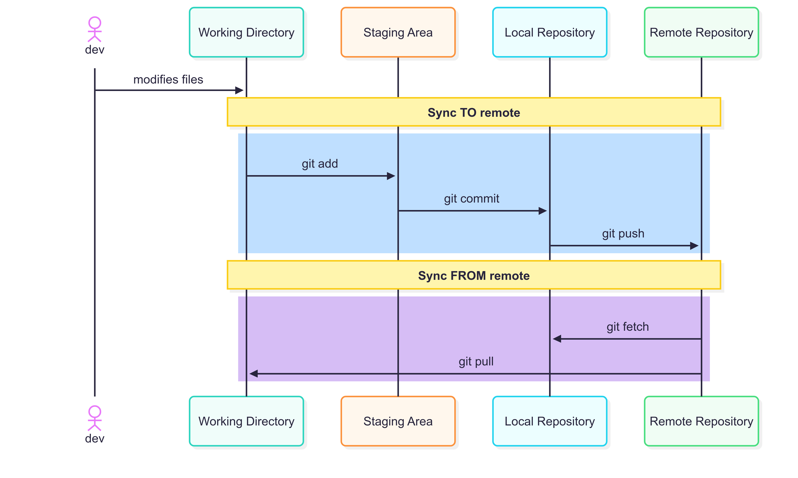
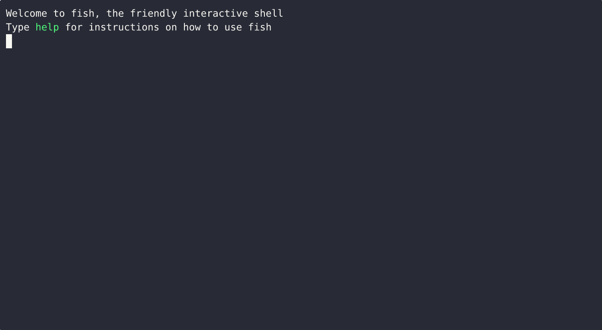
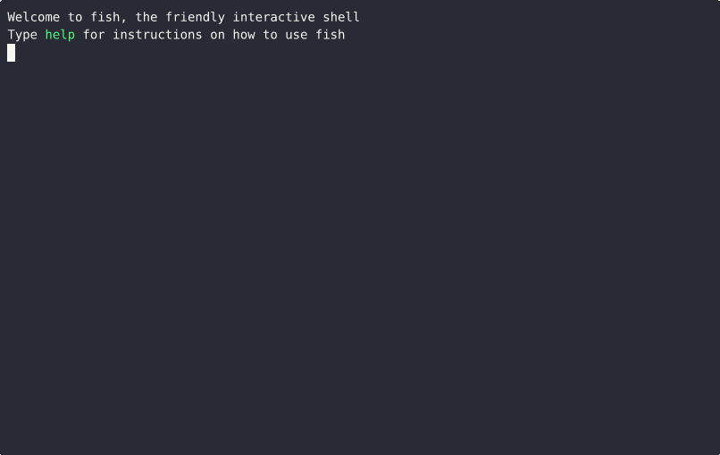

# Git's 3 Magic Words - `add`, `commit`, `push`

## "Scroll of Arcane Git Commands"

## Demos

### What happens when a tracked file is edited?

### What happens when an untracked file is edited?

### Does restoring staged changes lose all the changes?

Thankfully, it doesn't! It just removes the changes from the staging area.

This demo show what happens when the file is untracked,

And this is what happens when the file is tracked,

### How do I make a commit?

The demo shows how to make a commit while being confident that only the changes you want are committed. 

### How does `gitignore` work?

