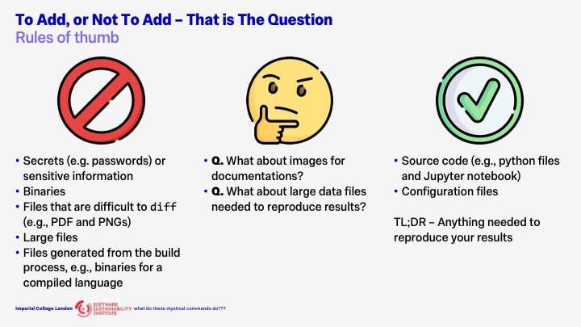

# Git's 3 Magic Words - `add`, `commit`, `push`

## "Scroll of Arcane Git Commands"

## To Add or Not to Add?

When working with Git, a key consideration is determining which files should be tracked in version control. While there are general best practices, each project’s requirements may differ, and some flexibility is often needed. The following guidelines outline what should and should not be included in a Git repository.

### What Not to Add?

#### Secrets and Sensitive Information

With **one crucial exception**, never commit secrets or sensitive data to Git. This includes passwords, API keys, private credentials, and any confidential information.
Even if a file containing such data is deleted later, it remains in the repository’s history. Fully removing it requires rewriting that history—a complex and error-prone process that poses significant security risks. This rule is absolute and must not be broken.

#### Binary Files

Binary files should generally not be added to Git. Git is designed for versioning text-based files, allowing it to efficiently track line-by-line changes. Binary files, such as executables or compiled libraries, cannot be diffed effectively. Including them will degrade performance, increase repository size, and may exceed hosting service limits such as those enforced by GitHub.

#### PDFs, Images, and Other Non-Text Assets

Files like PDFs and PNGs also present challenges because Git cannot meaningfully compare their contents. They can bloat the repository and slow down operations.
However, exceptions exist. If your project is small, the files are impractical to reproduce, tied closely to the source code, and change infrequently, including them may be appropriate.

#### Large Files

Even large text-based files can cause performance issues. Such files should typically be managed outside the repository using tools like Git Large File Storage (Git LFS) or other data management solutions.

#### Generated and Build Artifacts

Files that are generated during the build process—for example, compiled binaries, minified scripts, or templated source files—should not be tracked. These can always be regenerated by running the build again. Excluding them keeps the repository lightweight and avoids unnecessary versioning of transient data.

### What to Always Add

The most important items to include in Git are those required to reproduce your results.

#### Source Code

All project source files should be version controlled. For a Python project, this includes `.py` files, Jupyter notebooks, and any supporting files such as `pyproject.toml` or `requirements.txt`.

#### Configuration Files

Configuration files for builds, simulations, or development tools are often overlooked but essential. Tracking these ensures that other contributors—or your future self—can reproduce results consistently and reliably.

In summary, commit everything that is essential for recreating your work, and exclude anything that can be regenerated, derived, or stored more efficiently elsewhere.

### When Rules Conflict

Certain cases naturally blur the lines.

For example, while binary files are generally discouraged, images used in documentation are often acceptable. Images can convey information that is difficult to express in text and typically do not change frequently. This repository is an example of when adding PNGs and gifs is more acceptable. (It still isn't great though...)

Similarly, while large files should not normally be stored in Git, there may be situations where they are necessary for reproducibility. In these cases, it is best to use dedicated tools or external storage solutions while keeping references within the repository.

## Demos

### What happens when a tracked file is edited?

### What happens when an untracked file is edited?

### Does restoring staged changes lose all the changes?

Thankfully, it doesn't! It just removes the changes from the staging area.

This demo show what happens when the file is untracked,

And this is what happens when the file is tracked,

### How do I make a commit?

The demo shows how to make a commit while being confident that only the changes you want are committed. 

### How does `gitignore` work?

