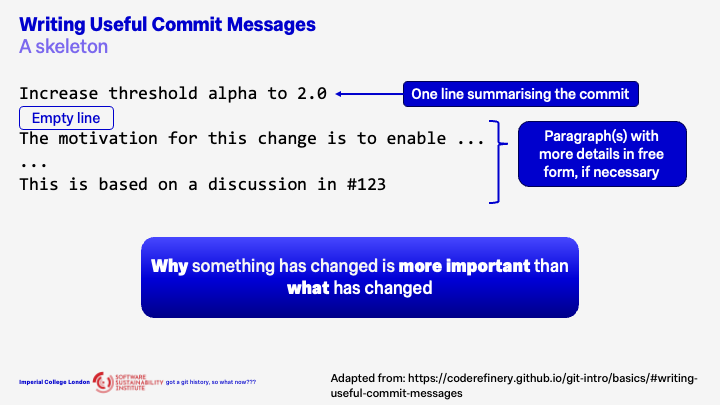

# Commit Messages - A Time Machine into the Past

    <iframe width="560" height="315" src="https://www.youtube-nocookie.com/embed/DibHlIHAhiw?si=K_qN00WtPK5fJkub" title="YouTube video player" frameborder="0" allow="accelerometer; autoplay; clipboard-write; encrypted-media; gyroscope; picture-in-picture; web-share" referrerpolicy="strict-origin-when-cross-origin" allowfullscreen></iframe>

## Skeleton for Effective Commit Messages

I highly recommend checking out [this website](https://coderefinery.github.io/git-intro/basics/#writing-useful-commit-messages) which is where the content in the slides below were adapted from.

## Tips for Writing Effective Messages

