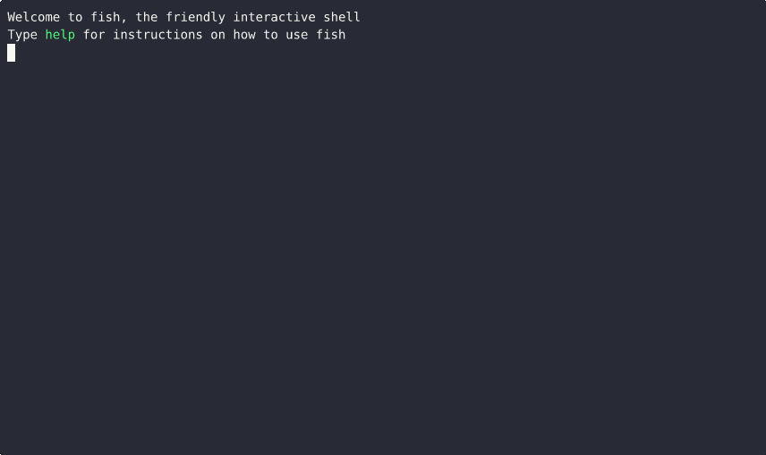

# Atomic Commits

    <iframe width="560" height="315" src="https://www.youtube-nocookie.com/embed/pg37nOWq23g?si=LkQ7flcCQ5Qe0DR6" title="YouTube video player" frameborder="0" allow="accelerometer; autoplay; clipboard-write; encrypted-media; gyroscope; picture-in-picture; web-share" referrerpolicy="strict-origin-when-cross-origin" allowfullscreen></iframe>

## Demos

Note: The explanation in with the demos have been converted from my script to a prose format with the help of the little helper called ChatGPT. I have read the output when formatting it properly for markdown, but might've missed something. Please do submit an issue if you spot a mistake!

### Why are non-atomic commits problematic?

When a commit contains multiple unrelated changes, it becomes difficult to understand the purpose of each individual difference. Reviewers (and even your future self) have to spend extra time untangling which change was meant to fix a bug, which was a refactor, and which was just a formatting tweak. This slows down code review, increases the chance of mistakes slipping through, and makes it harder to revert or isolate a single change later.

This demo illustrates how combining multiple, unrelated changes into a single commit can make it difficult to understand, review, or separate those changes later.

During the demo, we scroll through a commit that includes two distinct modifications: 1) a logic bug fix; 2) an update to how the closest pressure level is computed

From the commit message, it’s clear that both of these updates are grouped together in one commit. As we inspect the diff, the following observations can be made:

- The first few lines of the diff correspond to changes related to the closest pressure level calculation.
- The next set of lines mixes both the logic fix and the pressure level computation changes.
- The remaining changes are again focused solely on the closest pressure level logic.

This structure makes it difficult to isolate one change from the other. If we later decide that these changes should be split into separate commits — for instance, to improve clarity or to revert only one part — it becomes cumbersome and error-prone.

The key takeaway is that small, focused commits are much easier to manage. When each commit represents a single, logical change, it’s simple to combine them later if needed, but splitting them apart after the fact is much harder.

### Why atomic commits are important for revert errant changes?

This demo demonstrates how to revert a commit in Git and highlights why it’s best practice to keep each commit focused on a single, isolated change.

From the `git log`, we can see that the commit to be reverted is the most recent one.
By running `git diff` between the latest commit and the current state of the repository, we can view the specific changes that were introduced.

Next, using the commit hash from the log, we execute the git revert command to undo the commit. When prompted for a commit message, the default message generated by Git is sufficient, so we proceed without modification.

After the revert operation completes:

- Running `git log` again shows that a new commit has been created to revert the previous commit.
- Running `git diff` between the latest commit and the current state displays the inverse of the original changes — lines removed are shown in red and prefixed with a minus sign (`-`).
- Finally, running `git diff` between the second-to-last commit and the revert commit shows no differences, confirming that the repository has been returned to its original state before the reverted change.

This demo underscores the importance of keeping commits small and focused. When each commit represents only one logical change, reverting becomes straightforward and predictable. However, if multiple unrelated changes are bundled together in one commit, reverting can unintentionally remove desired updates along with the problematic ones.

### How do I use `git add -p` to select specific changes?

This demo demonstrates how to use `git add -p` (also known as patch mode) to split larger sets of changes into smaller, focused commits. A key practice for maintaining atomic commits.

When developing, it’s easy to work on multiple aspects of a project at once. As a result, the changes in your working directory may span several unrelated updates. To keep commits meaningful and organized, it’s important to separate these changes into logical parts before committing.

In this demo, we begin with a diff showing many unrelated changes. The goal is to commit only those changes related to documentation.

1. Identifying the relevant changes: The `git diff` output shows a mix of modifications. To isolate the documentation updates, we’ll use `git add -p`.
2. Use patch mode to review and select changes: Running `git add -p` breaks the changes into smaller hunks (blocks of edits). For each hunk, Git asks whether you want to stage it. Typing `y` stages the change, while `n` skips it. If a hunk contains both relevant and irrelevant changes, you can instruct Git to split it further, allowing fine-grained control.
3. Selectively stage changes: We proceed through the hunks, adding only those related to documentation by answering `y` or `n` accordingly. This same functionality is available in most IDEs.
4. Verify staged changes: Running `git diff --staged` confirms that only the selected documentation changes are staged.
5. Commit with a clear message: We then make a semantic commit describing the documentation-related update. Since it’s a straightforward change, additional explanation isn’t necessary.
6. Check remaining changes: Running `git status` shows that other modifications are still uncommitted, while `git log` confirms that the new commit has been created successfully.

This workflow highlights the value of `git add -p` in maintaining clean, atomic commits. By reviewing and selectively staging changes, you can ensure each commit represents one logical, self-contained piece of work — improving traceability, collaboration, and future debugging.

