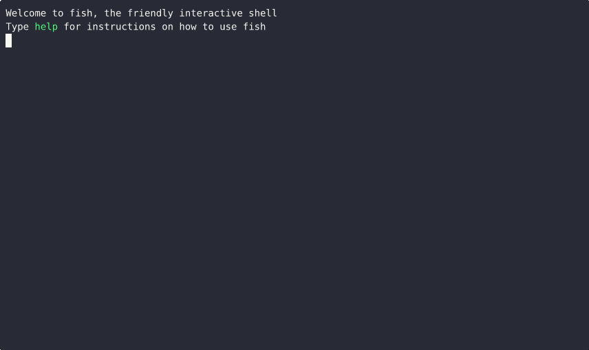

# Branches - A Glimpse into the Multiverse

    <iframe width="560" height="315" src="https://www.youtube-nocookie.com/embed/f25_qMAf-h8?si=ICG1e0wUjfq6EhYH" title="YouTube video player" frameborder="0" allow="accelerometer; autoplay; clipboard-write; encrypted-media; gyroscope; picture-in-picture; web-share" referrerpolicy="strict-origin-when-cross-origin" allowfullscreen></iframe>

## Demos

### How to create a new branch

### Switching between branches with conflicting changes

Explain stashing and explain why git worktree (next) is a good solution to this problem

### How does `git worktree` work?

